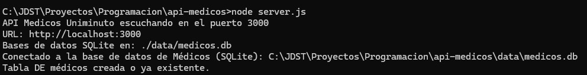
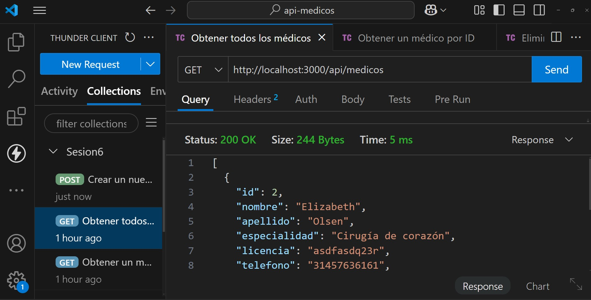

**README.md**

# Ejemplo: API usando NodeJs y Express

## Docente: José Danilo Sánchez Torres

Este proyecto consiste en un proyecto de una API Web sencilla basada en la librería ExpressJs que puede ser usado para gestionar la información de médicos.

## Requisitos Previos

* **Node version 20.18.0 o superior:** Asegúrate de tener NodeJs instalado y configurado correctamente en tu sistema.
* **IDE (Opcional):** Se recomienda utilizar un IDE como Visual Studio Code.
* **Base de datos (Opcional):** El proyecto cuenta con el uso de SQLITE como base de datos relacional de memoria.

## Configuración

Las propiedades de la aplicación se encuentran en el archivo `src/main/resources/application.properties`.

### Propiedades Comunes (archivo .env)

* **`PORT`**: Puerto en el que se ejecutará la aplicación.
* **`MEDICOS_API_URL`**: URL asociado a la URL del proyecto.

### Ejemplo de `application.properties`


## Compilación

Para compilar el proyecto, ejecuta el siguiente comando en la raíz del proyecto:

```bash
npm install
```

Este comando descargará las dependencias, compilará el código fuente y creará un archivo node_modules en la carpeta principal del proyecto.

## Ejecución

### Ejecución desde la línea de comandos

Para ejecutar la aplicación desde la línea de comandos, navega hasta el directorio `build/libs` y ejecuta el siguiente comando:

```bash
node server.js
```



### Ejecución desde cliente HTTP

Se sugiere utilizar el plugin Thunder Client para ejecutar las peticiones HTTP de tipo GET, POST, PUT y DELETE de la información de médicos:



Nota: para mayor información importe el archivo thunder-collection_Sesion6 que representa la colección Thunder Client y ejecutar cada operación del proyecto.

## Dependencias

Las dependencias del proyecto se gestionan desde el archivo package.json del proyecto.

## Estructura del Proyecto

```
api-medicos/
├── config/
│   ├── dbMedicos.js
├── controllers/
│   │   └── medicoController.js
├── data/
│   │       └── medicos.js
├── models/
│   │       └── MedicoService.js
├── routes/
│   │       └── medicoRutas.js
└── .env
└── package.json
└── README.MD
└── server.js
```


